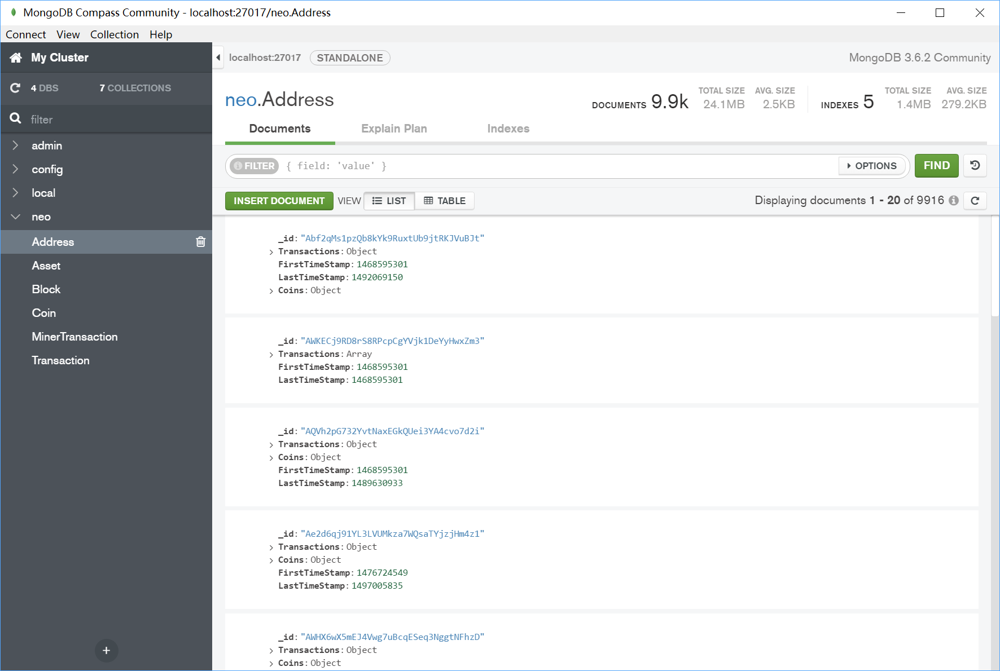
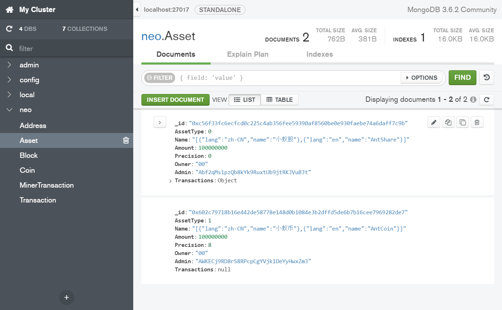
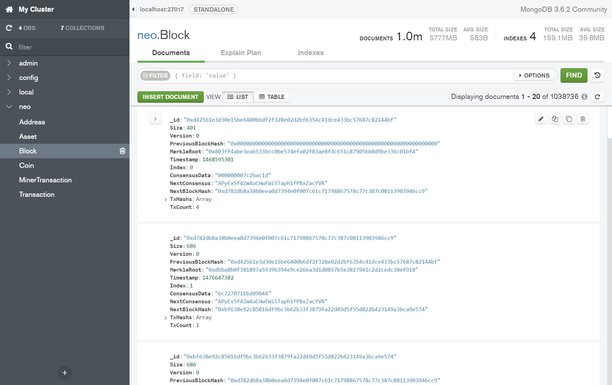
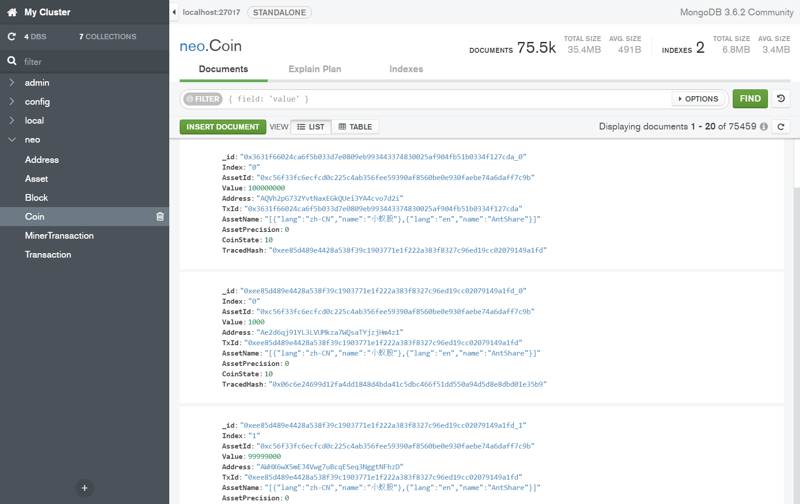
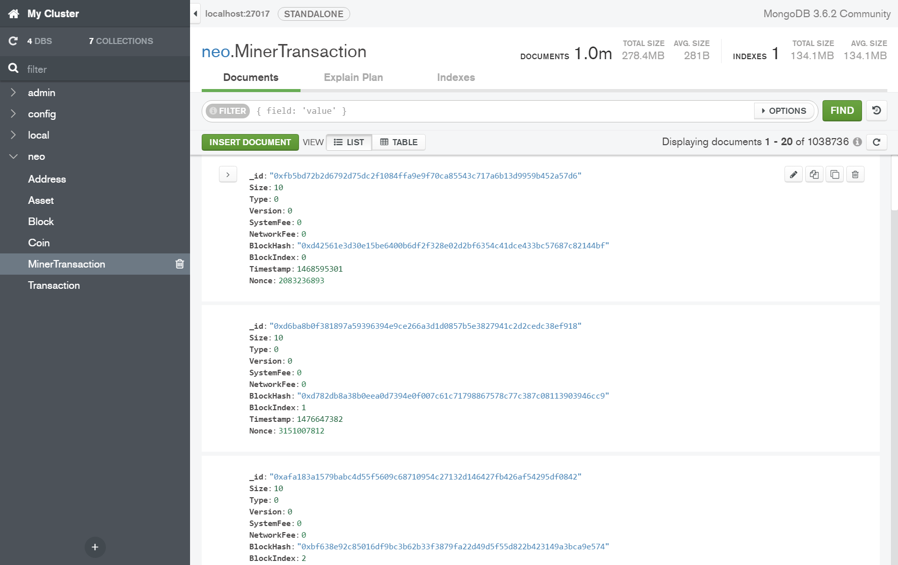
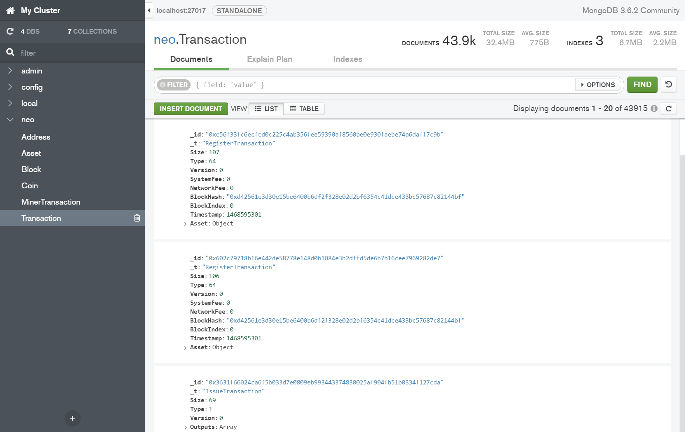

# NeoBlockchain2MongoDB

## 简介：

该程序可以将 NeoBlockchain 中的数据转到 MongoDB 中，本程序可以当做区块链浏览器的入库程序。

## 使用方法：

1、安装 MongoDB [下载链接](https://www.mongodb.com/download-center#community) [使用说明](https://docs.mongodb.com/manual/tutorial/install-mongodb-on-windows/)

2、安装 neo-cli，并启动 rpc 服务 [安装说明](http://docs.neo.org/zh-cn/node/setup.html)  [命令参考](http://docs.neo.org/zh-cn/node/cli.html)

3、在 App.config 配置 MongoDB 链接字符串和 neo-cli 的 rpc 请求地址

4、运行 NeoBlockchain2MongoDB 程序

注：本程序在 2017 年 7 月时可以稳定工作，之后进行了少量更新，但未经完整测试，不确定是否与最新版的 neo-cli 兼容。

## 截图：

截图来自 MongoDB 自带的可视化管理工具 MongoDB Compass Community 

Address
记录所有地址，每个地址的交易（Transactions），每个地址的余额（Coins）

Asset
记录所有资产，每个资产的名称、总量、精度、所有者、管理员、交易列表等信息

Block
记录所有区块的区块头以及交易 ID

Coin
记录所有 Coin，以及每一枚 Coin 资产 ID，资产名，数量，状态，来源和去向等信息

MinerTransaction
记录所有 MinerTransaction，将 MinerTransaction 单独存储，以加快 Transaction 集合处理速度

Transaction
记录所有 Transaction，每个交易的详细信息，详细的交易输出以及交易输出

